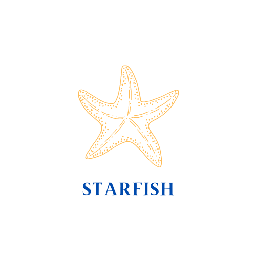

Hi, my name is Gemma and I’m currently working on the diachrony of null subjects in Latin American Spanish.

Broadly, my research interests fall under sociolinguistics, language contact, the history of English, historical syntax, and corpus linguistics. If you love the intersection of all those things, check out my research group [STARFISH](https://www.ling.uni-konstanz.de/en/walkden/starfish/).

When I'm not researching, I love to travel, cook, knit, and consume as much television as possible.

You can download my full CV [here](cv/CV-2023.pdf).

.
